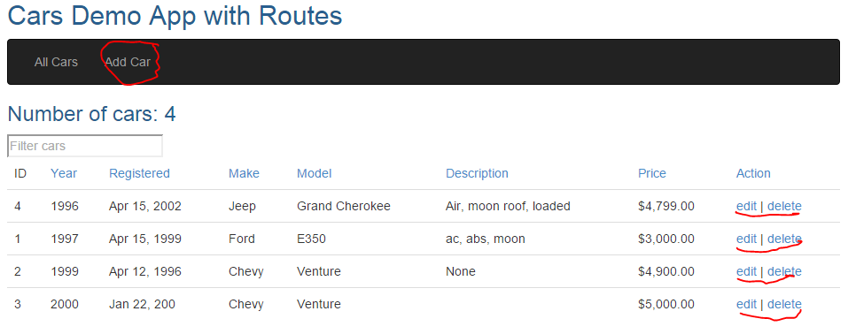

# Car app with Routing

If you have not already done so, now is the time to complete the exercise from [UsedCarsEx2.md](UsedCarsEx2.md). This provided the full CRUD API to the simple list used for day-1's start exercise and should look similar to this: [https://sem3exercises.herokuapp.com/carsCRUD/index.html](https://sem3exercises.herokuapp.com/carsCRUD/index.html)

In this exercise you should change this application, where everything was available in a single view, into something like this:

 

When "Add Car" or edit for a single car is pressed the View should change to a form where we can Add an new or Edit an existing car similar to the previous version of the exercise.

You should have (at least) two components one for the "all Cars View"and one for The Add/Edit view.

Use the factory below (we will come back to factories and services next week) to share data between the two Controllers.

**carApp**.**factory**(**'CarFactory'**, **function **() {
**var **cars =  [
 { **id**: 1, **year**: 1997,**registered**: **new ***Date*(1999,3,15), **make**: **'Ford'**,**model**: **'E350'**, **description**: **'ac, abs, moon'**, **price**: 3000 }
,{ **id**: 2, **year**: 1999,**registered**: **new
***Date*(1996,3,12), **make**: **'Chevy'**, **model**: **'Venture'**, **description**: **'None'**, **price**: 4900 }
,{ **id**: 3, **year**: 2000,**registered**: **new
***Date*(199,12,22), **make**: **'Chevy'**, **model**: **'Venture'**, **description**: **''**, **price**: 5000 }
,{ **id**: 4, **year**: 1996,**registered**: **new
***Date*(2002,3,15), **make**: **'Jeep'**, **model**: **'Grand Cherokee'**,**description**: **'Moon roof'**,**price**: 4799 }]
  **var **nextId = 5;
  **var ***getCars *= **function **() {**return **cars;}
  **var ***deleteCar *= **function **(id) {
​    **for **(**var **i = 0; i < cars.**length**; i++) {
​      **if **(cars[i].**id **=== id) {
​        cars.splice(i, 1);
​        **return**;
​      }
​    }
  }
  **var ***addEditCar *= **function**(newcar){
​    **if **(newcar.**id **== **null**) {
​      newcar.**id **= nextId++;
​      cars.push(newcar);
​    }
​    **else **{
​      **for **(**var **i = 0; i < cars.**length**; i++) {
​        **if **(cars[i].**id **=== newcar.**id**) {
​          cars[i] = newcar;
​          **break**;
​        }
​      }
​    }
  }
  **return **{
​    **getCars**: *getCars*,
​    **deleteCar**: *deleteCar*,
​    **addEditCar**: *addEditCar
  *};
});

 

You can inject you factory into the controller like this (leave out $scope if you are using the Controller-as Syntax):

 

carApp.*controller*(**'ViewCarController'**, [**'$scope'**, **"CarFactory"**, **function **($scope, CarFactory) {