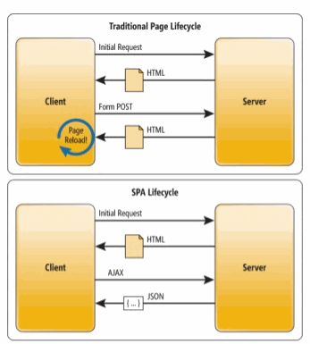

  
#React day 1  
##SPA, Architecture, frameworks and libraries  


**Study:**  
[**video tutorial here**](https://egghead.io/lessons/react-react-fundamentals-development-environment-setup)  and ES6 topics here:

1. [Arrows and Lexical This](http://babeljs.io/learn-es2015/#ecmascript-2015-features-arrows-and-lexical-this)  
2. [Classes](http://babeljs.io/learn-es2015/#ecmascript-2015-features-classes)  
3. [Template Strings](http://babeljs.io/learn-es2015/#ecmascript-2015-features-template-strings)   
4. [Destructuring](http://babeljs.io/learn-es2015/#ecmascript-2015-features-destructuring)   
5. [Default + Rest + Spread](http://babeljs.io/learn-es2015/#ecmascript-2015-features-default-rest-spread)  
6. [Let + Const](http://babeljs.io/learn-es2015/#ecmascript-2015-features-let-const)  
7. [Modules](http://babeljs.io/learn-es2015/#ecmascript-2015-features-modules)  
8. [Subclassable Built-ins (extends)](http://babeljs.io/learn-es2015/#ecmascript-2015-features-subclassable-built-ins)  
9. [Promises](http://babeljs.io/learn-es2015/#ecmascript-2015-features-promises)  
  
###Libraries to choose from:  
| Library                                  |
| ---------------------------------------- |
| [React](https://facebook.github.io/react/docs/installation.html) |
| [jQuery](http://learn.jquery.com/about-jquery/) |
| [AngularJS](https://docs.angularjs.org/tutorial) |
| [Angular2](https://angular.io/docs/ts/latest/quickstart.html) |
| [Ember](https://guides.emberjs.com/v2.11.0/tutorial/ember-cli/) |
| [Vue](https://vuejs.org/v2/guide/)       |

Choosing a framework for our front-end development comes down to personal taste and preference but lets take a look at how other people [feel about the biggest 2](https://medium.com/javascript-scene/angular-2-vs-react-the-ultimate-dance-off-60e7dfbc379c#.a736uyrpb)   

###Framework vs. Library  
Difference between a full application with Model-View-Control or just representing the View part (and Control) but leaving the model for others to deal with.


    
[**Principle: Inversion of control**](https://www.devbridge.com/articles/dependency-injection-in-javascript/)

###Single Page Application (SPA)  
    

1. We get the html page from the server
2. Every change and user interaction with the page updates some part of the content
3. Date to and from the server will happen with AJAX requests in the background
4. Certain components (HTML elements) will be updated.
   
###React js  
The chosen library for this 3rd semester.
####Points about React js  
1. Declarative like HTML: (rather than imperative as traditional java and javascript)

2. Component based: A component could be a form input, button, or any other element in a user interface

    

3. Virtual DOM

4. [JSX (XML like language)](https://www.tutorialspoint.com/reactjs/reactjs_jsx.htm)   

5. Components with state 
   -> render() runs when state changes  

6. Data is passed (down) through props  

7. Data is passed up through input parameter to functions that was passed down with props.

     

**Virtual DOM:**  


####Look at an example  
[basic.html](../demo/day1/basic.html)  

####Preparation  
Install jetbrains webstorm (free student license) [here](https://www.jetbrains.com/student/)  
If not allready done: install [node.js](https://nodejs.org/en/download/)

####Quick introduction to NPM   
NPM - [Node Package Manager](https://www.sitepoint.com/beginners-guide-node-package-manager/)

####Small exercise   
1. Open [basic.html](../demo/day1/basic.html) in WebStorm editor
2. Make it much simpler by
   1. Making it so it becomes simply a hello-world component. 
   2. Then change the component to have a message in the 'state' object and show this message when the component is rendered. 
   3. Delete all unnecessary code from the component.
   4. Run the html file in a browser.


##ES6 Ecma Script version 6 (also called ES2015)  
ES5 came in 2009 but was not supported in many browsers. From around 2012 ES5 became the defacto standard for javascript.
See the ES5 features and in which browsers they are supported [here](https://kangax.github.io/compat-table/es5/)  
See the ES6 features and in which browsers and/or compilers they are supported [here](http://kangax.github.io/compat-table/es6/).  
<br>
  
####Arrow functions in ES6:  
Lets look at how to filter and map a javascript array [here](https://developer.mozilla.org/en/docs/Web/JavaScript/Reference/Functions/Arrow_functions).
  
#### Demo  

filter()

```javascript
//with an old-school function
var arr = cars.filter(function(car){
    if(car.year < 2000){
        return car;
    }
});
//with an arrow function
var arr = cars.filter(car => car.year >= 2000);
arr.forEach(car => console.log(car.make));
```

map()

```javascript
    var carTableContent = cars.map(function(car){
        return '<tr><td>'+car.id+'</td><td>'+car.make+'</td><td>'+car.model+'</td></tr>';
    });
//or with arrow
	cars.map(car=>'<tr><td>'+car.id+'</td><td>'+car.make+'</td><td>'+car.model+'</td></tr>');
```

####Small exercise

1. Create an array of person 10 objects like: `{id: 1, name: 'Elizabeth', age: 34}`
2. use array filter function to get only persons above the age of 40.
3. use array map function to add a year to every person 
4. change your filter() and map() functions to use arrow notation for the callback function.


###Destructuring arrays and objects  
`var [no1,,no3,no4,,] = ["First","Second","Third","Fourth","Fifth", "Sixth"];` //creates 3 variables containing the values on the equivilent places  
`var myObject = {var1: 'some', var2: 'content', var3: 'here'}; `  
`myFunction({var1, var2}){ console.log(var1+" "+var2)}`
`myFunction(myObject);`

###Template strings   
(back ticks and ${} inside string to show content of variables):  
```var myString = `hello mister ${person.name}`. ```  // Also preserves newlines and indent etc.
  
###Variables and constants  
- var, let (block scope), const (immutable)

  ​


